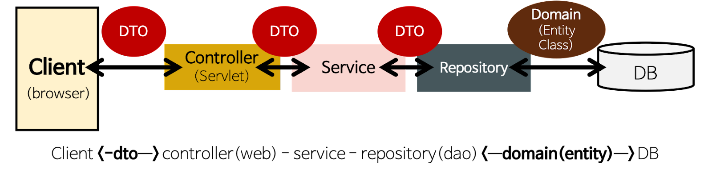

# 멋사스네스(MutsaSNS)

 

## 🌈 서비스 소개 🌈

### 1. 회원 인증·인가

- 모든 회원은 회원가입을 통해 회원이 됩니다.

- 로그인을 하지 않으면 SNS 기능 중 피드를 보는 기능만 가능합니다.

- 로그인한 회원은 글쓰기, 수정 기능이 가능합니다.

### 2. 글쓰기
- 포스트를 쓰려면 회원가입 후 로그인(Token 받기)을 해야 합니다.

- 포스트의 길이는 총 300자 이상을 넘을 수 없습니다.

- 포스트의 한 페이지는 20개씩 보이고 총 몇 개의 페이지인지 표시가 됩니다.

- 로그인 하지 않아도 글 목록을 조회 할 수 있습니다.

- 수정 기능은 글을 쓴 회원만이 권한을 가집니다.

- 포스트의 삭제 기능은 글을 쓴 회원만이 권한을 가집니다.

 

## 📚 기술 스택 📚

 

 

## ✨ 개발 환경 ✨

- 에디터 : Intellij Ultimate

- 개발 툴 : SpringBoot 2.7.5

- 자바 : JAVA 11

- 빌드 : Gradle 6.8

- 서버 : AWS EC2

- 배포 : Docker

- 데이터베이스 : MySql 8.0

- 필수 라이브러리 : SpringBoot Web, MySQL, Spring Data JPA, Lombok, Spring Security

 

## 💼 아키텍처 💼

## 🚩 API EndPoint 🚩

- 회원가입(Join): POST /api/v1/users/join

- 로그인(Login): POST /api/v1/users/login

- 포스트 작성: POST /api/v1/posts

- 포스트 수정: PUT /api/v1/posts/{postId}

- 포스트 삭제: DELETE /api/v1/posts/{postId}

- 포스트 리스트: GET /api/v1/posts

- 상세 포스트: GET /api/v1/posts/{postId}

 

## ☁ Swagger 주소 ☁

http://ec2-54-180-25-165.ap-northeast-2.compute.amazonaws.com:8080/swagger-ui/ 

 

## 🍀 1주차 체크리스트 🍀

✅ 인증 / 인가 필터 구현
   - 이전에 병원 리뷰 작성 프로젝트를 참고하여 인증과 인가 필터를 구현했습니다.
   - 추가로 토큰에 대한 예외도 JSON 형식으로 출력하기 위해 AuthenticationEntryPoint의 구현체를 만들어 커스텀 예외 처리를 진행했습니다.

✅ 회원가입 / 로그인 API 구현
   - 예외처리에 중점을 두어 구현했습니다.

✅ 포스트 작성 / 수정 / 삭제 / 상세 포스트 / 리스트 API 구현
   - 예외처리에 중점을 두어 구현했습니다.

✅ 커스텀 에러 처리 구현
   - 노션 페이지의 ErrorCode를 참고하여 ErrorCode를 만들었습니다.
   - 노션 페이지의 공통 에러처리의 방식으로 Return 하도록 구현했습니다.

✅ 회원가입 / 로그인 테스트 코드 작성
   - 위에서 구현한 기능을 모두 테스트하는것을 중점적으로 작성했습니다.

✅ 포스트 작성 / 수정 / 삭제 / 상세 포스트 / 리스트 테스트 코드 작성
   - 위에서 구현한 기능을 모두 테스트하는것을 중점적으로 작성했습니다.

✅ Swagger를 이용해 API 문서 자동화

✅ Gitlab CI & Crontab CD를 이용해 AWS EC2 서버에 1분마다 자동으로 배포 되도록 구현
   - 강사님 블로그를 참고해 CI/CD 스크립트를 작성했습니다.

